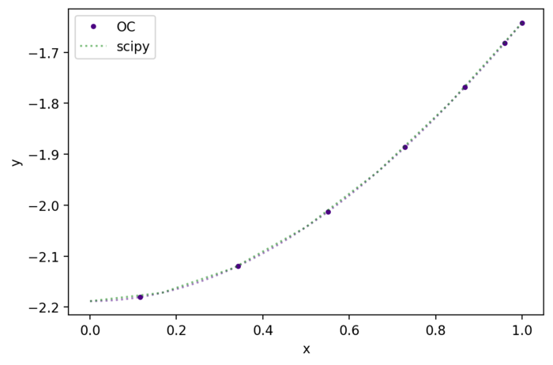

# collocation
A repository with a Python implementation of Orthogonal Collocation by Villadsen and Stewart (1967) for solving second order boundary value problems with symmetry.

See two simple examples and a real world problem in the notebook [example_collocation](https://github.com/bruscalia/collocation/blob/main/notebooks/example_collocation.ipynb).

## Install
As it is a very short package, we have not made it available via PyPi. So the user must either clone the repository using git (see code below) or download the files and use in a corresponding directory.

```
pip install -e git+https://github.com/bruscalia/collocation#egg=collocation
```

## Usage

```python
import numpy as np
from collocation.bvp import OrthogonalCollocation
```

The user must define a function that returns zeros in internal points and another that returns zeros in the surface boundary.

```python
#Internal function
def fun_1(x, y, dy, d2y, k):
    
    return d2y[0] + k * y[0] + 1

#Boundary function
def bc_1(x, y, dy, d2y, k):
    
    return dy[0] - 1

k = 1.0
```

Then must instantiate a problem using the **OrthogonalCollocation** class, define initial estimations and collocate points. The points are available in the *y* property of the problem and the method *interpolate* might provide values given *x* coordinates.

```python
#Create problem
problem_1 = OrthogonalCollocation(fun_1, bc_1, 6, 1, x0=0.0, x1=1.0, vectorized=True)

#Initial estimation
y01 = np.zeros([1, n_points + 1])

#Collocation using scipy.optimize.root in backend
problem_1.collocate(y01, args=k, method="hybr", tol=1e-6)
```

### Visualization


## Citation
This was developed as a part of the modeling in the styrene reactor simulation project:

Leite, B., Costa, A. O. S. & Costa Junior, E. F., 2021. Simulation and optimization of axial-flow and radial-flow reactors for dehydrogenation of ethylbenzene into styrene based on a heterogeneous kinetic model. Chem. Eng. Sci., Volume 244, p. 116805. doi:10.1016/j.ces.2021.116805.

The code is uploaded on ResearchGate and can be cited linked to doi:10.13140/RG.2.2.17223.78240.

## Original Article
Villadsen, J. & Stewart, W. E., 1967. Solution of boundary-value problems by orthogonal collocation. Chem. Eng. Sci., 22(11), pp. 1483-1501.

## Contact
e-mail: bruscalia12@gmail.com
